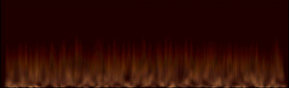
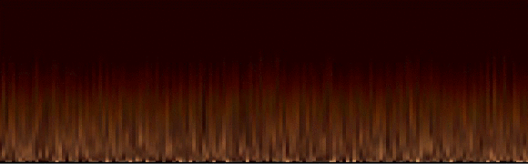
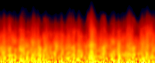
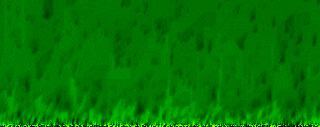
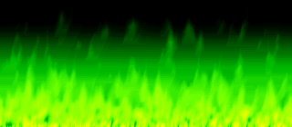
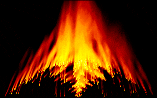
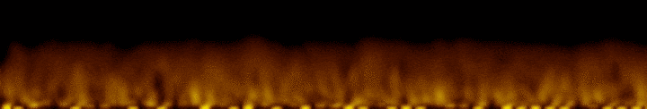

# PyFire

## Prehistory
 
This is my research about implementation fire effect.
I wanted to find the simplest and fastest realization that effect with python and pygame.
Unfortunate, operations with separate pixels in the pygame too slow.
You can verify this yourself by running the regular version of program:
    
		python fireg.py

And as you can see, it work very very slowly:

For comparison, you can see below how quickly a similar algorithm does work, implemented on pure assembler in the DOS system.
You can find corresponded binaries in the 'bin' folder of project. 
And you can properly execute them in the [DOSBox][1] environment.
These programs work very fast even on ancient computers and have screen frame synchronization procedure like “Synk” (see pascal version) for speed reduction. 

Or the pascal version (with some inline assembler tricks):

## Work around

The first way to improve Python responsibility to work with array of pixels little above than small size – is to use NumPy library. 
But this doesn't optimal decision because we have been translating arrays from PyGame to Numpy and vice versa. 
The secondary way is to use OpenCV Python framework with NumPY.
And the third way is to use OpenGL library for Python.

## Optimized with OpenCV fire demo

This way looks very good and fastest. Like in this GIF:

In addition I added ability to write all output to video file. Just press a 'V' key to start recording. 

# Requirements:

* Python
* PyGame
* NumPY
* OpenCV
 
# Project structure:
 
## Folders:

*	img - screenshots, images, etc.
*	src - additional source files.
*	bin - compiled binaries.
 
## Files:
	
* [fireg.py](fireg.py) - regular version of fire effect for python & pygame 
* [firecv2.py](firecv2.py) - version with OpenCV framework
* [FIRE.ASM](src/FIRE.ASM) - assembler source version
* [FIRE.EXE](bin/FIRE.EXE) - binary (assembler) for DOS (16 bit)
* [FIRE.COM](bin/FIRE.COM) - 256b INTRO version for DOS
* [FIRE.ASS](src/FIRE.ASS) - 256b INTRO version source code
* [FIREPAS.PAS](src/FIREPAS.PAS) - Pascal version source.
* FIREPAS.EXE - Binary of pascal version for DOS (Borland Pascal 7.0, 16 bit)

# AUTHOR
   An0ther0ne

[1]: https://www.dosbox.com/ "DOSBox offisial site."
[2]: https://youtu.be/oFza4WA_P8I "Whatch Fire on YouTube" 
